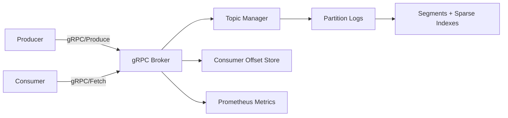

# Architecture Design

This document details the multi-component architecture, internal data paths, and component layout of the Distributed Message Broker.

## Components Layout

- **gRPC Broker**: The entry point for client RPCs, handling client requests for topic administration, record production, fetching, and offset management.
- **Topic Manager**: Coordinates topic lifecycle, resolves partition routing, and handles partition open/close mappings.
- **Partition Logs**: Multi-segment log system maintaining raw partition record streams.
- **Segments & Sparse Indexes**: Raw partition data is appended to active segment logs. As soon as a segment reaches maximum size, a roll is triggered. Sparse indexes keep map pointers from relative offsets to physical file positions.
- **Consumer Offset Store**: Manages customer offsets persisted on the broker-managed append-only consumer-offset log.
- **Prometheus Metrics**: Exposes operational telemetry, latencies, and Go runtime stats.

---

## Data Paths Sequence

### 1. Produce Request Flow
1. **gRPC validation**: Handler validates client requests (valid topic names, payload bounds).
2. **Partition routing**: The client or broker determines target partition.
3. **Partition lock**: Topic manager obtains the partition write lock.
4. **Append & Checksum**: Records are formatted as a batch, assigned monotonically increasing sequential offsets, checksummed (CRC32), and appended to the active segment log file.
5. **Index mapping**: If the append size crosses the index interval bytes limit, a sparse index entry mapping relative offset to physical position is added.
6. **Flush / Sync**: 
   - Under **sync** mode: `fsync` is triggered on the file descriptor immediately before responding.
   - Under **async** mode: the write is left to the OS page-cache flush.
7. **Telemetry**: Storage observers record execution durations, records written, and payload size.

### 2. Fetch Request Flow
1. **Coordinate index lookup**: Target partition's sparse index locates the closest physical segment position matching or preceding the requested offset.
2. **File read**: Read records from the calculated position.
3. **Validation**: Assert record batch CRC32 checksums to prevent corruption leakages.
4. **Filter and Respond**: Filter records starting exactly at the requested offset up to the requested max byte size limit.
